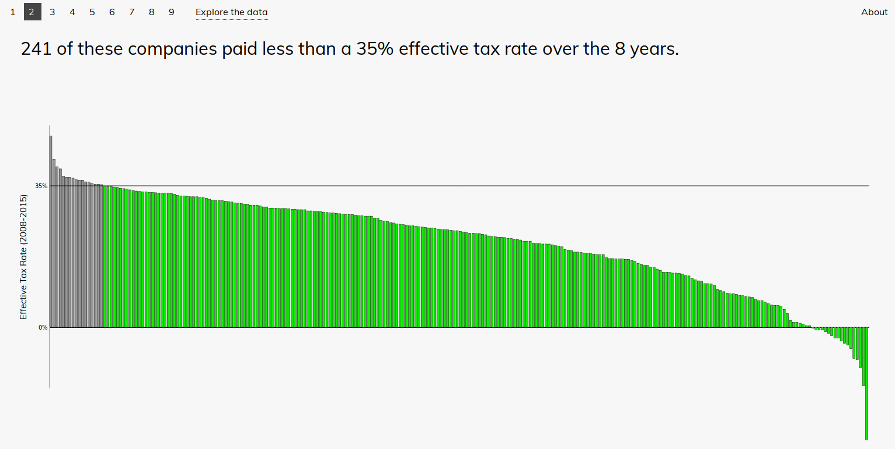

# The Perfect Number

## Background
The federal corporate income tax rate in the United States is supposedly 35%, but the truth is that corporations rarely pay that amount. Many large companies pay well below this rate using loopholes and tax breaks, often the result of aggressive corporate lobbying and campaign support. This project visualized the data behind claims that reducing taxes will make the US more competitive with foreign nations and that companies will take their extra profits and reinvest them in their workforces. We used data from reports by the [Institute on Taxation and Economic Policy](https://itep.org/wp-content/uploads/35percentfullreport.pdf) and the [Institute for Policy Studies](https://ips-dc.org/wp-content/uploads/2017/08/EE17-final-embargoed-for-August-30.pdf).

Check it out at http://theperfectnumber.pedal.tech/.

## Features

- The storyline component of the project takes the user through several arguments that are highlighted in the ITEP and IPS reports.
- The data explorer allows the user to explore the amount of tax paid by individual companies, and compare them to various other monetary quantities.
